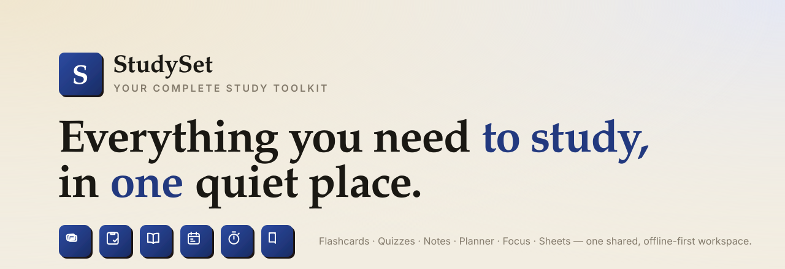

<div align="center">



<br>

**A calm, offline-first study suite for students.**
One hub, six focused tools, one shared brain — your subjects, decks, exams and stats line up across every app.

<br>


</div>

<br>

## Why StudySet

Most study apps do one thing, live in one silo, and forget everything the moment you switch tabs. StudySet is **one workspace** where the tools actually talk to each other:

> You write **notes** → turn the cues into a **flashcard deck** → drill them with spaced repetition → spin the deck into a **quiz** → schedule the whole thing against your **exam** → and run **focus** sessions that already know what's due. The **hub** watches it all and tells you what to do next.

No sign-up, no server, no tracking. Everything saves locally in your browser.

<br>

## The six tools

| | Tool | What it does |
|---|------|--------------|
| ◈ | **Flashcards** | Leitner-box **spaced repetition** — flip a card, grade *Again / Hard / Good / Easy*, and it reschedules itself. "Study all due" spans every deck. |
| ◈ | **Quizzes** | Build multiple-choice & true/false **practice tests**, take them timed, get a score ring and a per-question review. Import any flashcard deck straight into questions. |
| ◈ | **Notes** | **Cornell method** — cues, notes, and a one-line summary. Full-text search, subject filters, and one-click "make flashcards from cues." |
| ◈ | **Planner** | **Exam countdowns**, a task board, and an **auto-generated day-by-day study plan** that rotates topics, spaces in rest days, and ends on final review. |
| ◈ | **Focus** | A **Pomodoro** timer that logs *real* study minutes → streaks + a 28-day heatmap, and surfaces the flashcards & tasks due for whatever you're working on. |
| ◈ | **Sheets** | Collapsible, **printable formula & cheat sheets** with lightweight markdown (`**bold**`, `` `code` ``, bullets). |

…all tied together by the **Hub**, which rolls up cards due, days to your next exam, tasks today, focus this week, and a live cross-app activity feed.

<br>

## How it all connects

```
          ┌──────────────────────── HUB ────────────────────────┐
          │   cards due · exam countdown · tasks · focus · feed  │
          └──┬─────────┬─────────┬─────────┬─────────┬──────────┘
             │         │         │         │         │
        Flashcards  Quizzes    Notes    Planner    Focus    Sheets
             │  ▲       ▲         │         ▲         ▲
             │  └───────┼─ import │         │         │
     grade & schedule   │  cues → deck      │   "what's due?"
             └──────────┴─── shared subjects + one local store ──┘
```

Every app is served from the same origin, so they share a single `localStorage` namespace (`studyset:`) and a single design system (`suite.css` / `suite.js`). That's why **subjects are colour-coded identically everywhere** and data flows freely between tools.

<br>

## Quick start

It must be served over HTTP (the apps share files and local storage) — not opened as `file://`. Any static server works:

```bash
python3 -m http.server 5400
# then open http://localhost:5400
```

Or with Node:

```bash
npx serve -l 5400
```

Each app seeds realistic demo content (biology, calculus, history) on first open. The hub has a **reset demo data** link to wipe the slate.

<br>

## Keyboard shortcuts

| Where | Key | Action |
|-------|-----|--------|
| Flashcards | `Space` | Flip the card |
| Flashcards | `1` `2` `3` `4` | Grade Again / Hard / Good / Easy |
| Quizzes | `A`–`D` | Pick an answer |
| Quizzes | `Enter` | Next question |
| Focus | `Space` | Start / pause the timer |

<br>

## Design & tech

- **Type** — Fraunces (editorial display serif), Inter (UI), JetBrains Mono (timers & data).
- **Look** — a warm "paper & ink" palette with an indigo accent and warm-gold highlights, layered warm shadows, subtle paper grain, and spring-based micro-interactions.
- **Accessible** — real focus rings, `prefers-reduced-motion` support, 4.5:1 text contrast in both themes, and a light/dark pairing designed together.
- **Stack** — plain HTML, CSS, and JavaScript. No framework, no bundler, no dependencies. ~90 KB total.

```
study-suite/
├── index.html          Hub — aggregates everything
├── flashcards.html     Spaced-repetition decks
├── quiz.html           Quiz builder + timed practice tests
├── notes.html          Cornell notes
├── planner.html        Exam countdowns, tasks, study plans
├── focus.html          Pomodoro + focus stats
├── reference.html      Formula & cheat sheets
├── suite.css           Shared design system
├── suite.js            Shared data layer, icons & UI helpers
└── docs/banner.svg     This banner
```

<br>

<div align="center">

Built with [Claude Code](https://claude.com/claude-code).

</div>
